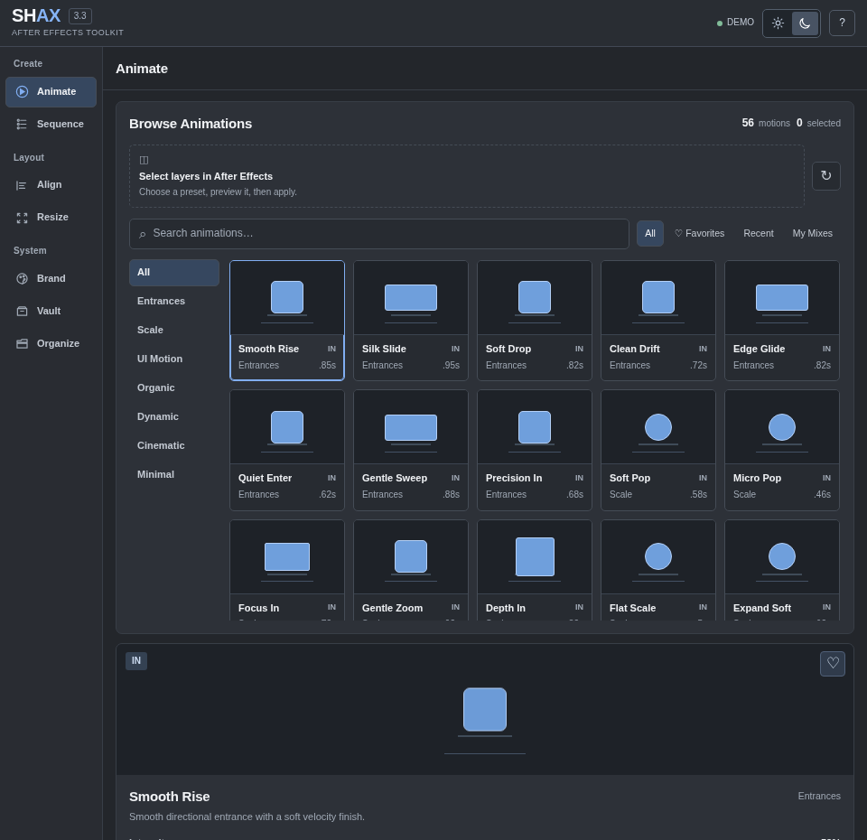
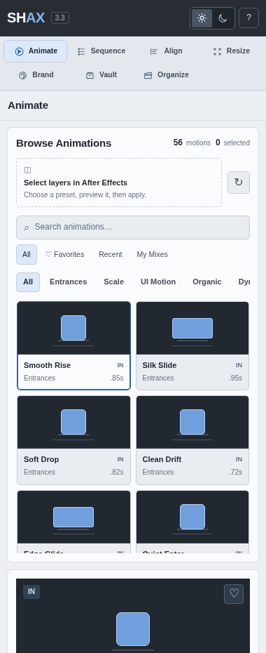
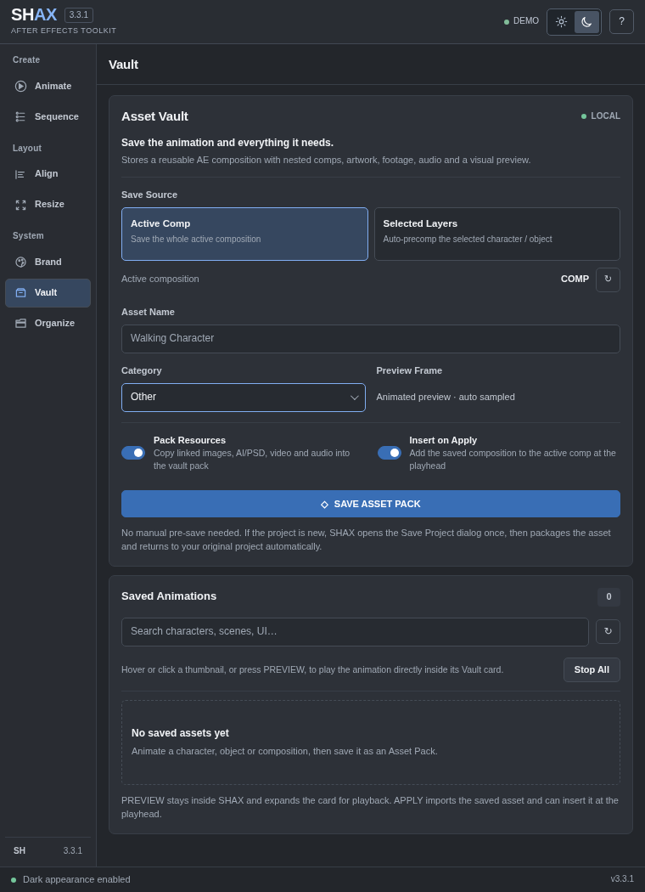

<div align="center">

# SHAX

**Motion, layout, and asset workflows for Adobe After Effects.**

A dockable CEP extension that keeps everyday motion-design tools in one place.

**Version 3.3.1** · Release candidate · macOS and Windows installers

</div>



<details>
<summary>See light theme and Vault interface previews</summary>

**Light theme**



**Vault category dropdown**



</details>

> **Preview note:** The UI screenshots were captured in a browser test environment, not from the After Effects host application. The release is a candidate and must still be tested in each target After Effects environment.

## What is SHAX?

SHAX brings reusable motion presets, animation libraries, organization, and layout tools into a single After Effects panel. It is built around a compact Adobe-inspired interface with both dark and light themes.

| Workspace | Capabilities |
| :--- | :--- |
| **Animate** | 56 built-in presets, visual preview, search, Favorites, SHAX Picks, My Mixes |
| **Sequence** | Order and stagger animations, adjust timing and overlap |
| **Align** | Illustrator-inspired alignment, distribute, spacing and 9-point anchor controls |
| **Resize** | Experimental composition resizing and recompose tools |
| **Brand** | Reusable colors, fonts, logos and motion signatures |
| **Vault** | Save a composition or selected-layer animation pack, preview and reuse it in another project |
| **Organize** | Organize project items and annotate layers |

## Install

**Requirements:** Adobe After Effects with CEP Legacy Extensions support. Manifest declares AEFT `[23.0,99.9]` (After Effects 2023+), but this does **not** guarantee every After Effects version is fully tested.

1. Download and extract the release ZIP (or download this repository as ZIP).
2. Close After Effects completely.
3. **macOS:** run `install-mac.command` (Control-click > Open if blocked).
4. **Windows:** run `install-windows.bat`.
5. Reopen After Effects and choose **Window → Extensions (Legacy) → SHAX**.

Detailed instructions: [Installation guide](docs/INSTALLATION.md).

## Typical workflows

**Use an animation:** select one or more layers → Animate → preview a preset → adjust settings → Apply.

**Reuse an animated scene:** select layers or a composition → Vault → Save Asset Pack → open another project → preview the saved item → Apply.

**Build a consistent brand:** set colors, fonts and motion signature in Brand → save the kit → apply to later work.

## Project status and limitations

**Release candidate, not an Adobe-certified or production-validated release.** JavaScript/manifest checks and browser UI checks were performed, but end-to-end tests inside After Effects on macOS and Windows are still required. Known limitations include:

- Deep Resize/Recompose operations are best effort and can disturb complex nested compositions. Work on duplicated files.
- Vault cannot package third-party effects or installed fonts, and preview requires renderable source assets.
- SHAX Picks uses basic heuristics based on selected layer types, not AI vision.
- My Mixes and user settings are local to the computer, not cloud-synced.
- macOS and Windows installers are available, but their operation depends on supported CEP/AE versions and system permissions.

See [Testing checklist](docs/TESTING.md) and [Architecture](docs/ARCHITECTURE.md).

## For developers

```text
SHAX/
├── CSXS/manifest.xml      # CEP extension metadata
├── index.html             # Panel markup
├── css/style.css          # Shared light/dark UI styles
├── js/app.js              # Panel logic and bridge calls
├── jsx/host.jsx           # After Effects ExtendScript operations
├── install-mac.command
├── install-windows.bat
├── docs/
└── screenshots/
```

The runtime contains no Node.js build step. Change source files, then reinstall or copy runtime assets to the CEP extension folder and restart AE. **Back up projects before testing any operation that modifies timelines or comps.**

## Design

SHAX uses a restrained dark/light interface with compact controls and one functional blue accent. Design review was informed by [Impeccable](https://github.com/pbakaus/impeccable), but SHAX does not bundle or require Impeccable.

## License

**No open-source license has been chosen yet.** Publishing source on GitHub makes it visible, but does not automatically grant permission to reuse, modify, or redistribute it. Please ask the project owner before reusing code.

SHAX is an independent project and is not affiliated with or endorsed by Adobe. Adobe After Effects is a trademark of Adobe Inc.